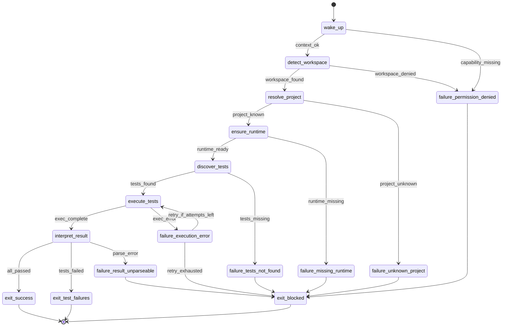
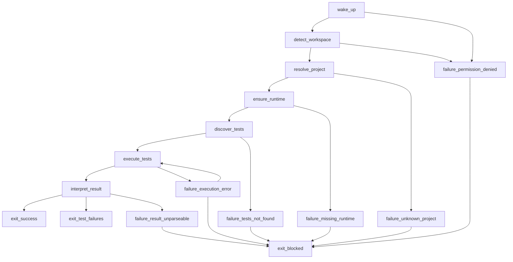

# `run_tests` SASS Projection

## State Diagram (`stateDiagram-v2`)

```mermaid
stateDiagram-v2
  [*] --> wake_up

  wake_up --> detect_workspace: context_ok
  wake_up --> failure_permission_denied: capability_missing

  detect_workspace --> resolve_project: workspace_found
  detect_workspace --> failure_permission_denied: workspace_denied

  resolve_project --> ensure_runtime: project_known
  resolve_project --> failure_unknown_project: project_unknown

  ensure_runtime --> discover_tests: runtime_ready
  ensure_runtime --> failure_missing_runtime: runtime_missing

  discover_tests --> execute_tests: tests_found
  discover_tests --> failure_tests_not_found: tests_missing

  execute_tests --> interpret_result: exec_complete
  execute_tests --> failure_execution_error: exec_error

  failure_execution_error --> execute_tests: retry_if_attempts_left
  failure_execution_error --> exit_blocked: retry_exhausted

  interpret_result --> exit_success: all_passed
  interpret_result --> exit_test_failures: tests_failed
  interpret_result --> failure_result_unparseable: parse_error

  failure_permission_denied --> exit_blocked
  failure_unknown_project --> exit_blocked
  failure_missing_runtime --> exit_blocked
  failure_tests_not_found --> exit_blocked
  failure_result_unparseable --> exit_blocked

  exit_success --> [*]
  exit_test_failures --> [*]
  exit_blocked --> [*]
```

## DAG View (`flowchart TD`)

```mermaid
flowchart TD
  wake_up --> detect_workspace
  wake_up --> failure_permission_denied

  detect_workspace --> resolve_project
  detect_workspace --> failure_permission_denied

  resolve_project --> ensure_runtime
  resolve_project --> failure_unknown_project

  ensure_runtime --> discover_tests
  ensure_runtime --> failure_missing_runtime

  discover_tests --> execute_tests
  discover_tests --> failure_tests_not_found

  execute_tests --> interpret_result
  execute_tests --> failure_execution_error

  failure_execution_error --> execute_tests
  failure_execution_error --> exit_blocked

  interpret_result --> exit_success
  interpret_result --> exit_test_failures
  interpret_result --> failure_result_unparseable

  failure_permission_denied --> exit_blocked
  failure_unknown_project --> exit_blocked
  failure_missing_runtime --> exit_blocked
  failure_tests_not_found --> exit_blocked
  failure_result_unparseable --> exit_blocked
```
