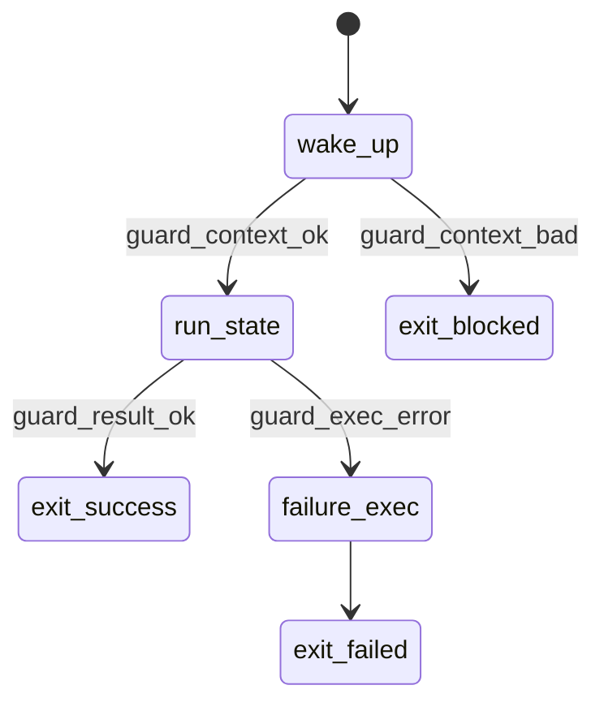
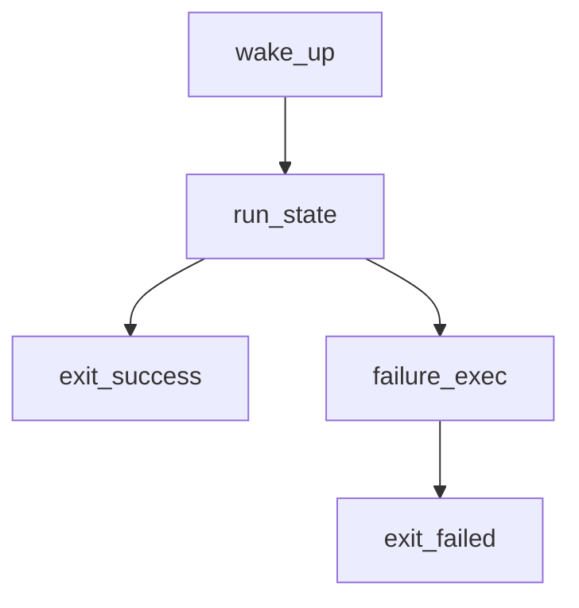

# State-Aware Skills Standard (SASS) v0.1

## Purpose

SASS v0.1 defines the minimal executable contract for Odin skills as explicit state machines. XML is the source of truth; Mermaid diagrams are projections.

## Terminology

- `skill`: executable unit with metadata, capability manifest, and runtime graph.
- `state`: named runtime phase with deterministic behavior.
- `transition`: directed edge between states, triggered by event/condition.
- `guard`: machine-checkable predicate that must pass for a transition.
- `failure transition`: transition to a failure or blocked state.
- `exit state`: terminal state ending execution (`success`, `blocked`, or `failed`).
- `wake_up`: mandatory entry/checkpoint state for resume-or-restart decisions.
- `coordinates snapshot`: persisted execution coordinates for deterministic resume.
- `idempotence`: re-entry behavior contract (`safe_repeat`, `requires_checkpoint`, `non_repeatable`).
- `capability discipline`: least-privilege capability allow/deny declarations enforced at runtime.

## Required Runtime Contract

- Every skill MUST have `runtime start_state="wake_up"`.
- Every skill MUST define a state with `id="wake_up"`.
- Every skill MUST define at least one terminal exit state.
- Operational transitions MUST be guarded (`guard_ref`).
- Failures MUST route through explicit failure transitions.

### Required `wake_up` State

`wake_up` is mandatory and performs:
- context recovery
- capability verification
- checkpoint inspection
- deterministic branch to `resume`, `restart`, or `exit_blocked`

No operational state may execute before `wake_up`.

## Coordinates Snapshot

Required fields:
- `workspace_root`
- `project_id`
- `task_id`
- `skill_id`
- `state_id`
- `attempt_count`
- `last_artifacts`
- `allowed_capabilities`

Coordinates must be persisted on each transition and reloaded during `wake_up`.

## Representations

### State Machine (`stateDiagram-v2`)

Use this representation for control-flow truth and resume/failure semantics.



### DAG (`flowchart TD`)

Use this representation for operator readability and high-level dependency flow.



## XML Skill DSL (Minimal)

```xml
<skill id="example.skill" version="0.1.0" scope="project" trust_level="CAUTION">
  <capability_manifest>
    <allow capability="repo.read"/>
    <deny capability="repo.delete"/>
  </capability_manifest>
  <runtime start_state="wake_up">
    <coordinates>
      <field name="workspace_root" required="true"/>
      <field name="project_id" required="true"/>
      <field name="task_id" required="true"/>
      <field name="skill_id" required="true"/>
      <field name="state_id" required="true"/>
      <field name="attempt_count" required="true"/>
      <field name="last_artifacts" required="true"/>
      <field name="allowed_capabilities" required="true"/>
    </coordinates>
    <guards>
      <guard id="guard_context_ok" expr="context.ready == true"/>
    </guards>
    <states>
      <state id="wake_up" type="checkpoint" idempotence="safe_repeat"/>
      <state id="exit_success" type="exit" terminal="true"/>
      <state id="exit_blocked" type="exit" terminal="true"/>
    </states>
    <transitions>
      <transition from="wake_up" to="exit_success" on="resume_or_restart" guard_ref="guard_context_ok"/>
    </transitions>
  </runtime>
</skill>
```

## Conformance

A skill is SASS v0.1 compliant only if:
- `wake_up` exists and is the runtime start state
- exits exist and are terminal
- operational transitions have guard references
- guard references resolve to declared guards
- failure transitions are explicit
